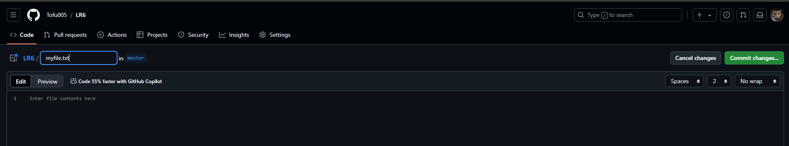
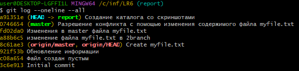
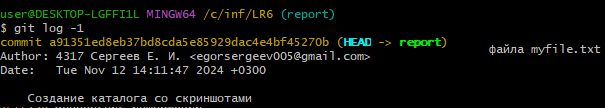
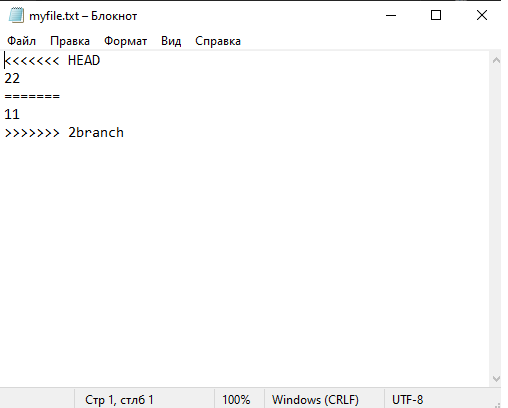

# LR6
Лабораторная работа №6

# Отчет по работе с Git

## 1. Изменение имени пользователя и указание электронной почты
Команда для изменения имени пользователя:

```bash
$ git config --global user.name "4317 Сергеев Е. И."
```

Команда для изменения электронной почты:

```bash
$ git config --global user.email "egorsergeev005@gmail.com"
```

## 2. Клонирование репозитория

```bash
$ git clone https://github.com/Antochhka/LR6
```

## 3. Добавление нового файла
*Скриншет с добавлением нового файла*


## 4. Добавление изменений в локальный репозиторий

```bash
$ git pull
```

## 5. Получение данных для каждой из веток

```bash
$ git log --oneline --all
```

*Результат работы команды*



## 6. Просмотр последних изменений

```bash
$ git log -1
```

*Результат работы команды*



## 7. Решение конфликта и слияние веток

```bash
$ git checkout master
$ git marge 2branch
```

Решение конфликта при помощи изменения содерждимого файла myfile.txt

*Содержимое файла myfile.txt при наличии конфликта*



## 8. Удаление побочной ветки после слияния

```bash
$ git branch -d branch1
```

## 9. Откат коммита

```bash
$ git reset --hard HEAD~1
```

## 10. Создание ветки для отчета

```bash
$ git checkout -b report
```

## 11. Получение истории операций в форматированном виде

```bash
$ git log --pretty=format:"%h %ad %an %s" --date=short
```

## 12. История операций
Список истории операций:
26d5bbc 2024-11-12 4317 Сергеев Е. И. Создание отчета и добавление скриншотов для него
a91351e 2024-11-12 4317 Сергеев Е. И. Создание каталога со скриншотами
0746654 2024-11-12 4317 Сергеев Е. И. Разрешение конфликта с помощью изменения содержимого файла myfile.txt
fd02da0 2024-11-12 4317 Сергеев Е. И. Изменения в master файла myfile.txt
a88b6c5 2024-11-12 4317 Сергеев Е. И. изменение файла myfile.txt в 2branch
8c61ae3 2024-11-12 Egor Sergeev Create myfile.txt
921f53b 2020-11-21 Kurtyanik Обновление информации
c08a654 2020-11-21 Kurtyanik Файл создан пустым
3c6e913 2020-11-21 Kurtyanik Initial commit
